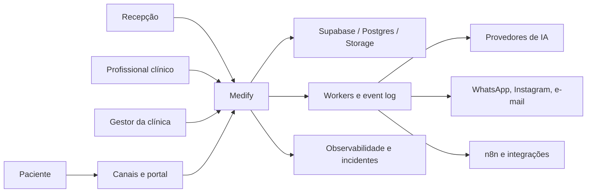
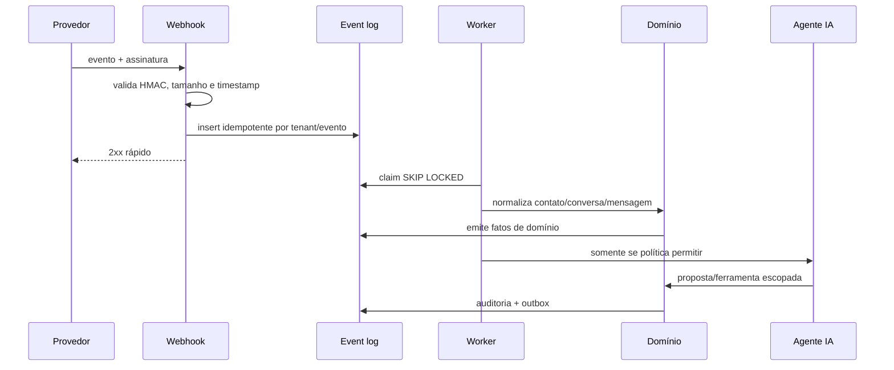
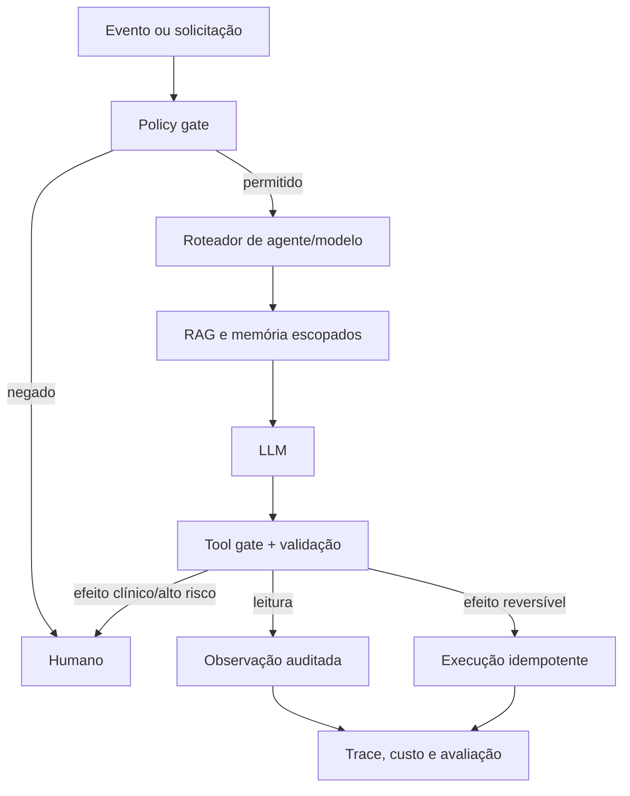

# Arquitetura do Medify

## Escolha estrutural

Monólito modular com workers e adapters. É a forma mais econômica de preservar
transações, evoluir o domínio e operar um primeiro SaaS sem a carga de uma malha de
microserviços. Limites de módulo são explícitos; extração futura exige evidência de
escala, ownership ou disponibilidade diferentes.

## Visão de contexto



## Containers lógicos

| Container | Responsabilidade |
|---|---|
| Next.js App Router | UI, Server Components, Route Handlers, auth e BFF |
| Supabase Auth | identidade, sessão validada e MFA |
| Postgres | fonte transacional, RLS, auditoria, filas duráveis e pgvector |
| Supabase Realtime | atualizações operacionais filtradas |
| Storage | mídia, conhecimento, documentos e exports com buckets separados |
| Agent worker | turnos de IA, ferramentas, custo, memória e follow-up |
| Event workers | webhooks, automações, notificações, LGPD e integrações |
| Redis opcional | rate limit, debounce e coordenação não-durável |
| Adapters | Meta/WAHA, e-mail, calendários, pagamento, n8n e LLMs |

## Módulos

- `identity`: auth, organizações, unidades, memberships, papéis e permissões.
- `patients`: contatos, perfis, dependentes, identidade e consentimentos.
- `scheduling`: agendas, recursos, consultas, lista de espera e lembretes.
- `engagement`: inbox, mensagens, canais, campanhas e templates.
- `crm`: pipelines, oportunidades, tarefas, score, risco e reativação.
- `clinical`: profissionais, encontros, prontuário, documentos e assinatura.
- `ai`: agentes, RAG, memória, skills, roteadores, casos e orçamento.
- `automation`: regras, flows, webhooks, follow-ups e n8n.
- `billing`: catálogo, orçamento, cobrança, repasse e relatórios.
- `privacy`: direitos, retenção, export, anonimização e incidente.
- `platform`: planos, limites, tenants, suporte e observabilidade.

## WalChat é código nativo, não integração externa

Todas as funcionalidades do WalChat serão absorvidas pelo monólito modular
MEDIFY. Instagram, conteúdo editorial, gatilhos, sequências, reengajamento,
auto-like, insights e compliance Meta usam os módulos, tenant, banco, UI, eventos
e workers do MEDIFY.

O WalChat não será mantido como segundo frontend, API, banco, autenticação, fila
ou deploy. Seu código é portado para módulos `social` e convergido com contatos,
inbox, agentes, campanhas e follow-ups canônicos. A matriz e o plano de
incorporação estão em
[`docs/architecture/WALCHAT-NATIVE-ABSORPTION.md`](docs/architecture/WALCHAT-NATIVE-ABSORPTION.md).

## Fluxo de entrada omnichannel



## Fronteiras de dados

1. **Operacional:** contato, agenda, conversa e funil; recepção pode acessar conforme papel.
2. **Clínica:** encontros e prontuário; exige assignment profissional explícito.
3. **Financeira:** cobrança e repasse; permissões próprias.
4. **Plataforma:** metadados de tenant; suporte não herda acesso clínico.
5. **IA:** fontes, memória e traces por organização; dados clínicos só entram com finalidade e policy.

## API

- Prefixo `/api/v1`.
- JSON em `snake_case`, UUID e ISO-8601 UTC.
- Resposta `{ data, meta? }` ou `{ error: { code, message, details? } }`.
- `X-Request-Id` em toda resposta.
- Zod em toda borda.
- Sessão com `getUser()` ou token API hasheado e escopado.
- Organização vem de membership/cookie validado, nunca do body.
- Mutação aceita `Idempotency-Key`.
- Cursor opaco e assinado para coleções grandes.
- 401 não autenticado, 403 não autorizado, 409 conflito, 422 validação, 429 limite.

## Eventos

Formato mínimo:

```json
{
  "event_type": "appointment.created",
  "organization_id": "uuid",
  "entity_kind": "appointment",
  "entity_id": "uuid",
  "payload": {},
  "metadata": {
    "request_id": "uuid",
    "actor_type": "user"
  }
}
```

Regras:

- trigger de banco não chama HTTP;
- handler registra estado + evento e retorna;
- worker é idempotente;
- retry exponencial com jitter;
- dead inbox visível e reprocessável;
- ação externa guarda external ID e correlation ID.

## IA



- Read-only é o default.
- Tool tem escopo, schema, timeout e orçamento.
- Prompt não é autorização.
- Dado recuperado é tratado como conteúdo não confiável.
- Broadcast e ação massiva exigem confirmação explícita.
- Ato clínico, assinatura, prescrição e diagnóstico exigem profissional.

## Deployment

Ambientes separados e contas separadas. Produção exige:

- app e workers sem root;
- Postgres gerenciado ou Supabase com PITR;
- storage privado e URLs curtas assinadas;
- Redis opcional com TLS;
- secrets em vault/painel, não em `.env` no Git;
- health/readiness separados;
- backups e restore testado;
- rollout por feature flag/tenant;
- SLOs e incident response.

## ADRs iniciais

1. DeskcommCRM é upstream de fundação, não produto final.
2. Next.js/Supabase permanecem até evidência contrária.
3. Monólito modular antes de microserviços.
4. Eventos duráveis antes de integração ponto a ponto.
5. Prontuário é um bounded context separado.
6. Super-admin não ganha leitura clínica por ser super-admin.
7. Meta Cloud API e WAHA são adapters intercambiáveis.
8. n8n orquestra integrações; não contém regra clínica canônica.
9. IA propõe; policy e domínio autorizam.
10. Docs Medify e migrations são fonte de verdade; handoffs upstream são referência.
11. WalChat é integralmente incorporado ao código MEDIFY; nenhum runtime WalChat
    externo participa da arquitetura final.

