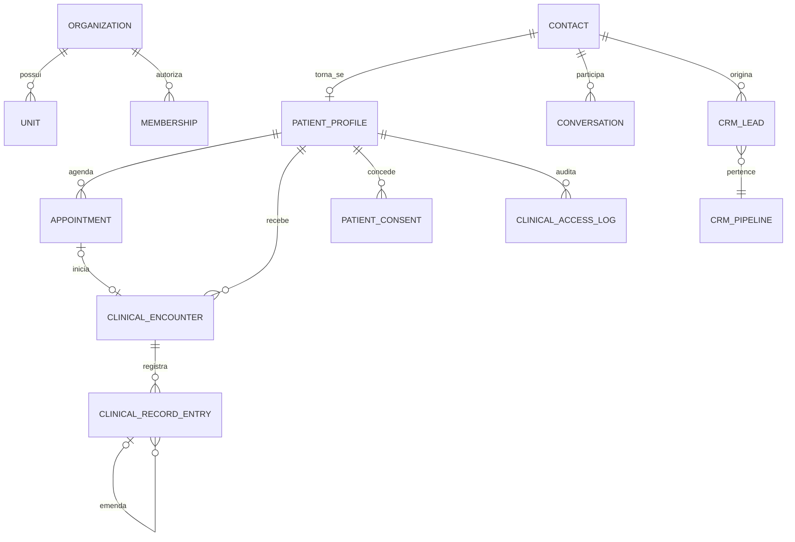

# Domínio e dados

## Modelo central

## Agregados e invariantes

### Organização

- Boundary de tenant.
- Toda entidade tenant-aware tem `organization_id NOT NULL`.
- ID recebido do cliente nunca define o tenant.
- Unidade pertence a exatamente uma organização.
- Suspensão bloqueia mutações e acessos operacionais conforme política.

### Contato

- Pessoa conhecida por um ou mais canais.
- Identidade pode existir sem ser paciente.
- CPF é cifrado para recuperação autorizada e hasheado para igualdade.
- Pessoa anonimizada não volta a ser identificável por update.
- Merge mantém rastreabilidade e não reatribui registro clínico sem revisão.

### Paciente

- Extensão 1:1 do contato dentro da organização.
- Número de prontuário é único por organização.
- Preferência de nome não apaga nome civil.
- Dados clínicos não entram em `patient_profiles.metadata`.
- Um paciente pode ter múltiplos responsáveis/dependentes em versão futura.

### Consulta/agendamento

- Fim é posterior ao início.
- Persistência em UTC; exibição no fuso da unidade.
- Profissional/sala/equipamento não podem ter sobreposição ativa.
- Cancelamento e no-show não apagam o agendamento.
- Observação operacional não recebe diagnóstico ou evolução.
- Evento externo/idempotency key é único por organização.

### Encontro clínico

- Pertence a um paciente e pode nascer de agendamento.
- Profissional deve ter assignment clínico ativo.
- Fechamento grava timestamp.
- Reabertura é evento auditado, não mudança silenciosa.

### Entrada de prontuário

- Autor, paciente, encontro, tipo e conteúdo são obrigatórios.
- Draft pode ser alterado pelo autor autorizado.
- Assinatura exige método, assinante, timestamp e hash.
- Entrada assinada não é atualizada nem excluída.
- Correção cria nova entrada que referencia a anterior.
- Export preserva versão, assinatura e encadeamento.

### Acesso clínico

- Exige membership e assignment clínico.
- Cada leitura informa finalidade.
- Log é append-only e contém ator, paciente, recurso, requisição e data.
- Break-glass terá fluxo separado, alerta e revisão posterior.
- Suporte de plataforma não recebe acesso implícito.

### Consentimento

- Finalidade, base legal, versão do documento e evidência são separadas.
- Revogação não apaga evidência histórica.
- Consentimento não é usado como base genérica quando outra base legal é aplicável.
- Marketing e cuidado têm finalidades distintas.

### Conversa

- É por canal/sessão e liga ao contato.
- Webhook é idempotente por organização + ID externo.
- STOP/PARAR bloqueia envios aplicáveis.
- Assignment humano/IA é explícito.
- Handoff preserva motivo, contexto e silêncio do bot.

### Oportunidade/funil

- Pode existir sem contato; isso é caso real, não erro de borda.
- Um contato pode ter múltiplas oportunidades.
- Toda automação contato→negócio usa um resolvedor canônico.
- Ambiguidade produz não-ação + rastro.
- Posição usa fractional indexing.

### IA

- Versão publicada é imutável.
- Run aponta modelo, versão, custo, fontes e ferramentas.
- Credencial é cifrada e nunca retornada após criação.
- Orçamento é verificado antes e contabilizado depois.
- Resultado clínico de IA é rascunho até validação profissional.

## Tabelas clínicas da migration 0096

| Tabela | Dados | Acesso |
|---|---|---|
| `patient_profiles` | extensão operacional do paciente | membros; escrita agent+ |
| `clinical_staff_assignments` | credenciamento e flags clínicas | próprio/manager lê; admin escreve |
| `appointments` | agenda operacional | membros; escrita agent+ |
| `clinical_encounters` | contexto assistencial | profissional clínico autorizado |
| `clinical_record_entries` | conteúdo clínico versionado | profissional clínico autorizado |
| `patient_consents` | finalidade/base/evidência | membros; manager governa |
| `clinical_access_log` | acessos justificados | ator insere; ator/manager lê |

## Padrões de dados

- UUID para IDs.
- `timestamptz` e UTC para instantes; `date` para datas civis.
- BRL em `value_cents bigint` + `currency char(3)`.
- Telefone E.164.
- CPF somente cifrado/hash.
- JSONB apenas para extensão real; campos consultados/validados viram colunas.
- `text + check` quando enum precisa evoluir por migration.
- Soft archive onde retenção exige; sem delete casual.
- Índice sempre começa pelo tenant quando a consulta é tenant-scoped.

## Próximas migrations

1. Unidades, salas, recursos e fuso.
2. Responsáveis/dependentes e preferências.
3. Recorrência, bloqueios e constraint de conflito.
4. Templates clínicos e observações estruturadas.
5. Documentos, anexos, assinatura e cadeia de hash.
6. Prescrição/exames com contratos próprios.
7. Retenção por classe e legal hold.
8. Financeiro e repasses.

