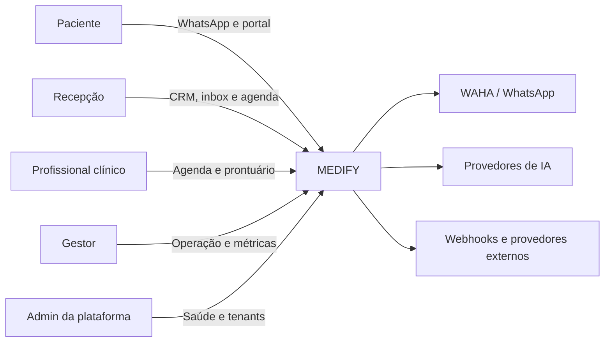
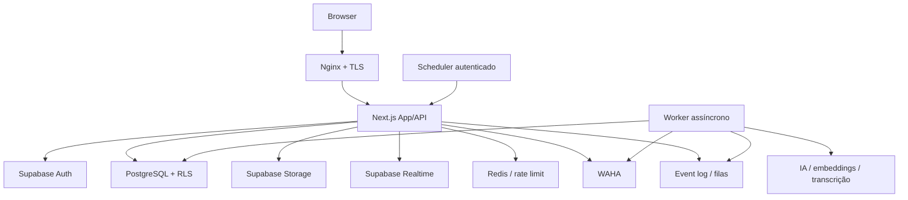
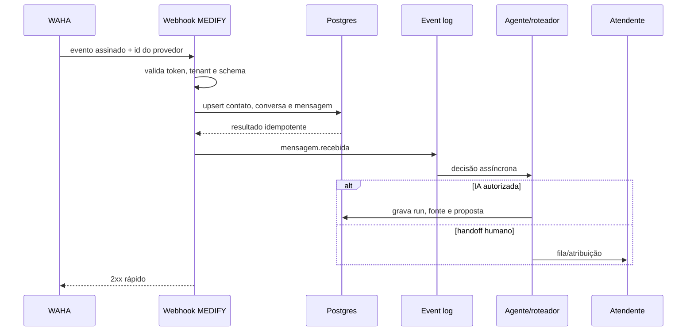
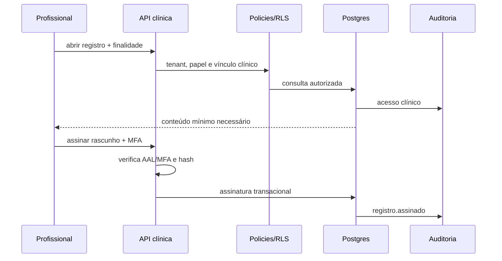
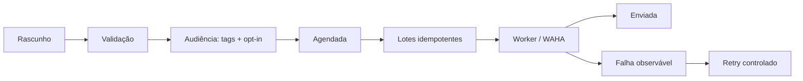

# Contexto, containers e fluxos

## Contexto

## Containers

Somente Nginx publica `80/443`. App, banco, Kong/Supabase, Redis, WAHA e workers
permanecem em redes Docker ou listeners de loopback.

## Fronteiras

- **Driver adapters:** páginas, rotas HTTP, webhooks, cron e MCP.
- **Aplicação:** casos de uso, autorização, validação, idempotência e auditoria.
- **Domínio:** contatos, jornadas, agenda, prontuário, consentimentos e eventos.
- **Driven adapters:** Postgres/Supabase, WAHA, Redis, storage e provedores de IA.

## Fluxo inbound do WhatsApp

## Fluxo clínico

## Fluxo de campanha

## Disponibilidade e degradação

- Sem IA: atendimento humano continua.
- Sem WAHA: CRM, agenda e prontuário continuam; fila de envio não é descartada.
- Sem Realtime: telas podem recarregar/pollar sem perder verdade persistida.
- Sem worker: operações síncronas continuam e backlog permanece observável.
- Sem banco/Auth: aplicação retorna indisponibilidade; não tenta operar em cache.
