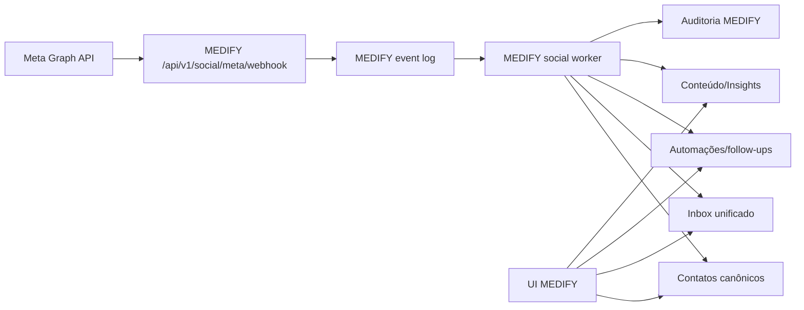

# Incorporação nativa e integral do WalChat

## Decisão

O WalChat **não será integrado como serviço externo**. Suas funcionalidades,
regras e fluxos serão incorporados ao código do MEDIFY e passarão a operar com:

- a mesma autenticação;
- o mesmo tenant;
- o mesmo banco e RLS;
- o mesmo design system e navegação;
- a mesma API `/api/v1`;
- o mesmo event log, workers e scheduler;
- a mesma auditoria, observabilidade e política de deploy.

O repositório WalChat permanece como fonte MIT, especificação comportamental e
oráculo de paridade. Ele não permanece como segundo produto em runtime.

## O que “nativo” significa



Não haverá:

- iframe ou link para o WalChat;
- proxy para outro domínio;
- segunda sessão/login;
- segundo cadastro de tenant;
- banco WalChat consultado em runtime;
- fila BullMQ separada apenas para WalChat;
- deploy `wal-chat-*` como dependência do MEDIFY;
- duplicação permanente de contatos, conversas, agentes ou campanhas.

## Estratégia de incorporação

“Colar os sistemas” significa portar o código e preservar o comportamento, mas
adaptar as fronteiras ao monólito modular. Não significa colocar uma aplicação
TanStack inteira dentro do Next.js ou manter dois modelos de identidade.

### Destino no código MEDIFY

```text
app/app/social/
├── dashboard/
├── triggers/
├── sequences/
├── reengagement/
├── content/calendar/
├── content/publish/
├── auto-like/
└── insights/

app/api/v1/social/
├── accounts/
├── compliance/check/
├── content/
├── insights/
└── meta/webhook/

lib/social/
├── domain/
├── meta/compliance.ts
├── meta/signature.ts
├── meta/sender.ts
├── meta/normalizer.ts
├── content/
└── insights/

workers/social/
├── inbound-worker.ts
├── scheduler-worker.ts
└── insights-worker.ts
```

Inbox, contatos, agentes, campanhas, auditoria e configurações continuam em seus
módulos canônicos. A pasta `social` contém somente comportamento específico de
Instagram/Meta.

## Paridade funcional

Legenda:

- **Base:** MEDIFY já possui fundação reutilizável.
- **Parcial:** existe comportamento genérico, mas falta semântica WalChat/Meta.
- **Portar:** funcionalidade WalChat ainda precisa ser incorporada.

| WalChat | Destino MEDIFY | Estado atual | Trabalho obrigatório |
|---|---|---|---|
| Dashboard de alcance, DMs, comentários e contatos | Dashboard social | Portar | KPIs, gráfico, atividade e atalhos |
| Inbox Principal/Geral/Pedidos/IA off | Inbox unificado | Parcial | canal Instagram, caixas e janela Meta |
| Contatos, tags e busca | Contatos canônicos | Base | perfil Instagram e elegibilidade |
| Exportação CSV | Contatos | Parcial | export autorizado/auditado |
| Gatilho por comentário | Automation rules | Portar | origem, palavra, match e Private Reply |
| Gatilho por DM | Automation rules | Portar | evento Meta normalizado |
| Gatilho por story reply | Automation rules | Portar | origem/story e contexto |
| Sequências texto/mídia/typing/delay | Follow-up flows | Parcial | steps sociais e scheduler |
| Agentes copiloto/autônomo | Agentes MEDIFY | Base | presets/personas WalChat e opt-out |
| Reengajamento com preview | Campanhas/follow-ups | Parcial | elegibilidade Meta e rate |
| Calendário editorial mês/semana | Conteúdo social | Portar | página, drag-and-drop e agenda |
| Criação Feed/Reel/Story/Carrossel | Conteúdo social | Portar | editor, copy, mídia e preview |
| Publicação Meta | Social sender | Portar | adapter, status e retry |
| Auto-like por regra/sentimento/palavra | Social engagement | Portar | regras, limites e auditoria |
| Insights e crescimento | Social insights | Portar | coleta, agregação e gráficos |
| Heatmap e top posts | Social insights | Portar | cache e análise |
| Leitura de insights por IA | IA + social insights | Parcial | tool read-only e contexto |
| Conta Instagram/configuração | Channel accounts | Portar | OAuth/token por organização |
| Webhook challenge | Meta webhook | Portar | verify token |
| Webhook assinado HMAC SHA-256 | Meta webhook | Portar | raw body + constant-time compare |
| Eventos messages/postbacks/comments/mentions/reactions | Inbound normalizer | Portar | contratos e fixtures |
| Data deletion signed request | LGPD + Meta | Portar | HMAC, protocolo e execução |
| Privacidade/Termos/Exclusão | Páginas públicas | Portar | conteúdo jurídico Medify |
| PWA/manifest/assets | Shell MEDIFY | Parcial | manifest e identidade unificada |
| Worker Instagram | Worker MEDIFY | Portar | consumidor do event log |
| Scheduler WalChat | Scheduler MEDIFY | Parcial | jobs sociais, locks e retry |

Paridade só é 100% quando todos os itens “Portar” estiverem implementados e os
itens “Parcial” tiverem comportamento equivalente comprovado.

## Regras de compliance que entram no domínio

O motor `lib/social/meta/compliance.ts` será uma função de domínio usada tanto na
prévia quanto imediatamente antes do envio.

Regras mínimas portadas do WalChat:

1. janela padrão de 24 horas após inbound;
2. `HUMAN_AGENT` até sete dias e proibido para automação;
3. STOP/PARAR com bloqueio imediato;
4. rodapé de opt-out em mensagem automática aplicável;
5. cooldown por contato/gatilho;
6. uma única Private Reply por comentário;
7. blocklist por organização;
8. revalidação no instante do envio;
9. decisão persistida com policy/motivo;
10. limite de taxa e retry idempotente.

Essas regras são versionadas por provider porque políticas Meta podem mudar.

## Mapeamento de dados

| WalChat | MEDIFY canônico |
|---|---|
| `workspaces` | `organizations` |
| `workspace_members` | memberships/papéis da organização |
| `instagram_accounts` | `social_channel_accounts` |
| `private.instagram_credentials` | credenciais cifradas do adapter |
| `contacts` | `contacts` + perfil de canal social |
| `tags` / `contact_tags` | tags canônicas |
| `conversations` / `messages` | inbox canônico com canal `instagram` |
| `interactions_log` | eventos, atividades e auditoria |
| `triggers` | `automation_rules` com trigger Meta |
| `trigger_cooldowns` | estado de execução/cooldown social |
| `comment_private_replies` | trava idempotente de Private Reply |
| `sequences` / `sequence_steps` | follow-up flows/versionamento |
| `sequence_enrollments` | enrollments de follow-up |
| `scheduled_jobs` | event log/scheduler MEDIFY |
| `webhook_events` | inbox de eventos inbound/idempotência |
| `ai_agents` | agentes/versionamento MEDIFY |
| `knowledge_documents` | fontes/chunks RAG |
| `campaigns` / `campaign_recipients` | broadcasts e destinatários |
| `blocklist_entries` | política de compliance social |
| `posts_cache` | cache de publicações sociais |
| `content_items` | planejamento/publicação social |
| `insights_daily` | métricas sociais diárias |

Uma migration nova estende o schema MEDIFY. A migration WalChat não será aplicada
integralmente porque duplicaria tenancy, contatos, conversas e agentes.

## Convergência da interface

- DMs Instagram aparecem na mesma Inbox, filtráveis por canal/caixa.
- O contato possui um perfil único com WhatsApp, Instagram e futuros canais.
- Agentes e automações são configurados uma vez e associados aos canais.
- “Social” concentra dashboard, gatilhos, conteúdo, auto-like e insights.
- Configurações de Meta vivem em conexões do tenant.
- Visual WalChat é convertido para tokens/componentes MEDIFY; não há segundo shell.

## Ordem de implementação

### Fase W1 — domínio e banco

- tipos de canal/evento/conteúdo;
- conta social e credencial cifrada;
- extensões de contato/conversa;
- conteúdo, insights, cooldown, Private Reply e blocklist;
- RLS e testes com dois tenants.

### Fase W2 — Meta inbound/outbound

- challenge e HMAC;
- persistência idempotente;
- normalizador;
- sender e status;
- worker e fixtures contratuais.

### Fase W3 — compliance, gatilhos e sequências

- motor 24h/7d/opt-out;
- triggers comentário/DM/story;
- steps texto/mídia/typing/delay;
- reengajamento e preview.

### Fase W4 — conteúdo e insights

- calendário;
- Feed/Reel/Story/Carrossel;
- publicação;
- auto-like;
- coleta diária, heatmap e top posts.

### Fase W5 — UX, legal e migração

- telas no shell MEDIFY;
- configurações/OAuth;
- privacidade, termos e data deletion;
- importador one-shot para instalações WalChat existentes.

### Fase W6 — gate de paridade

- portar testes unitários e smoke WalChat;
- E2E por módulo;
- validar Live Mode em tenant piloto;
- desligar qualquer runtime WalChat separado;
- marcar 100% somente com matriz e evidência verdes.

## Critérios de aceite final

- 100% dos itens da matriz implementados;
- nenhuma chamada do MEDIFY para a aplicação WalChat;
- um login, um tenant, uma UI, um banco e um deploy;
- HMAC, RLS, idempotência e compliance cobertos por teste;
- todos os fluxos funcionam fora de `DEMO_MODE`;
- tokens Meta por organização, cifrados e rotacionáveis;
- observabilidade e runbook integrados;
- licença/atribuição preservadas;
- runtime WalChat independente desnecessário.
