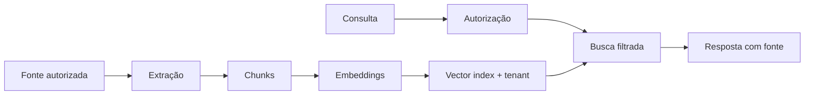

# IA, RAG e memória

## Componentes

- credenciais de provedores cifradas;
- catálogo de providers/modelos;
- agentes versionados;
- routers e membros;
- runs, casos e inbox de revisão;
- fontes de conhecimento e indexação;
- memória organizacional versionada;
- skills instaláveis;
- orçamento, pacing, uso e evolução;
- follow-up flows.

## Ciclo de um agente

1. Manager/admin cria agente ou nova versão.
2. Prompt, tools, limites e modelo são configurados.
3. Versão é testada com contexto controlado.
4. Publicação cria referência imutável.
5. Dispatcher seleciona agente/router.
6. Run registra entrada minimizada, resultado, custo e decisão.
7. Handoff humano ocorre por regra, risco ou falha.

## RAG

O filtro de organização/classificação acontece antes da similaridade. Conteúdo
recuperado é dado, não instrução. Fonte removida deve deixar de participar de
novas respostas e disparar processo de reindexação/expurgo.

## Guardrails

- allowlist de tools;
- schema estrito de argumentos;
- timeouts e limite de passos;
- orçamento mensal e ação ao atingir 100%;
- redaction/minimização;
- citação e incerteza;
- bloqueio de ação clínica autônoma;
- revisão humana para mensagens e decisões de risco;
- kill switch independente do provedor.

## Credenciais

Valor da chave é aceito somente pelo backend, cifrado com chave fora do banco e
nunca retornado integralmente. Revalidação não expõe o segredo. Logs mostram
provedor e identificador, não a chave.

## Operação sem provedor

Na ausência de chave de IA:

- login, CRM, inbox humana, agenda e prontuário continuam;
- rotas de IA informam configuração pendente;
- eventos não são descartados silenciosamente;
- nenhuma credencial fictícia é usada.

## Dados clínicos

Enviar dado clínico a LLM exige contrato, base/finalidade, região, retenção e
minimização aprovados. IA não assina prontuário, diagnostica ou prescreve.
