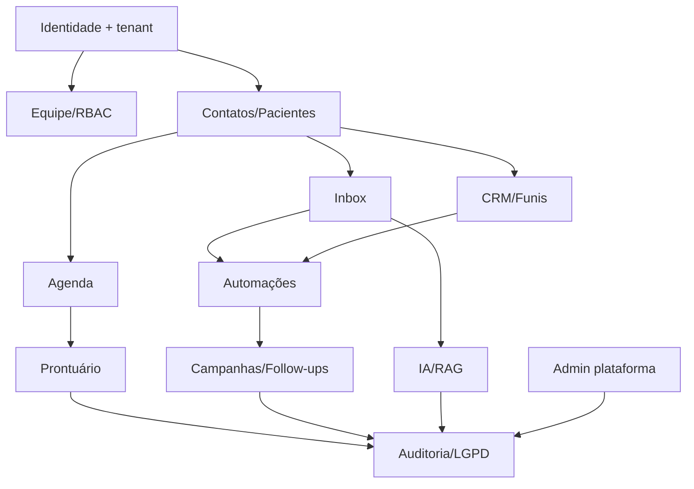

# Módulos funcionais

| Módulo | Capacidades | Superfícies | Estado 0.9 |
|---|---|---|---|
| Identidade | Login, recovery, MFA, sessão, convite | `/login`, `/app/settings/security` | Entregue |
| Organizações | Multi-tenancy, onboarding, configuração | `/onboarding`, `/app/settings/tenant` | Entregue |
| Equipe | Convites, papéis, disponibilidade, revogação | `/app/team` | Entregue |
| Inbox | Conversas, mensagens, mídia, notas, claim e transferência | `/app/inbox` | Entregue |
| Contatos | CRUD, deduplicação, tags, importação e timeline | `/app/contacts` | Entregue |
| CRM | Pipelines, estágios, Kanban, ganho/perda e próxima ação | `/app/kanban`, `/app/pipelines` | Entregue |
| Agenda | Listagem/criação e associação paciente-profissional | `/app/appointments` | Beta |
| Pacientes | Cadastro, vínculo com contato e visão operacional | `/app/patients` | Beta |
| Prontuário | Leitura justificada, rascunho, assinatura MFA | `/app/clinical/records` | Beta controlada |
| Campanhas | Tags, opt-in, lote, agendamento e envio | `/app/broadcasts` | Entregue |
| Templates | Mensagens reutilizáveis e atalhos | `/app/templates` | Entregue |
| Automações | Regras, runs, retry e webhooks | `/app/automations`, `/app/webhooks` | Entregue |
| Follow-ups | Fluxos, publicação, rollback e inscrições | `/app/ai/followups` | Entregue |
| Agentes de IA | Versões, testes, publicação, orçamento e casos | `/app/ai/agents` | Pronto; requer provedor |
| RAG | Fontes, upload, indexação, memória e skills | `/app/ai/knowledge`, `/app/ai/memory` | Pronto; requer provedor |
| Métricas | Atendimento, radar e evolução | `/app/metrics`, `/app/radar` | Entregue |
| LGPD | Solicitações, preview, aprovação e anonimização | `/app/lgpd`, `/admin/lgpd` | Entregue |
| Auditoria | Consulta, detalhe e exportação | `/app/audit`, `/admin/audit` | Entregue |
| Plataforma | Tenants, usuários, uso, incidentes e saúde | `/admin` | Entregue |
| WhatsApp | Sessões, QR, reconexão e webhooks WAHA | `/app/connections` | Requer pareamento |
| API/MCP | Tokens com escopo, API v1 e ferramentas MCP | `/app/settings/api-tokens`, `/api/mcp` | Entregue |

## Dependências entre módulos

## Critério de “entregue”

“Entregue” significa código integrado, superfície navegável e contrato de backend
presente. Integrações marcadas “requer provedor” dependem de credencial/contrato
externo. “Beta controlada” exige os gates explicitados na documentação de
segurança antes de uso assistencial real.
