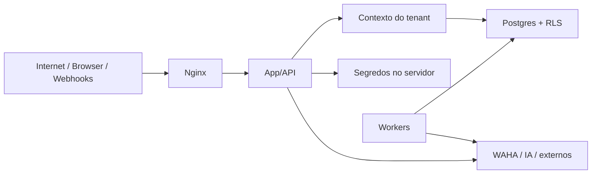

# Threat model

## Escopo e ativos

Ativos principais:

- identidade, sessão e fatores MFA;
- dados pessoais e dados de saúde;
- prontuários assinados e anexos;
- credenciais de WhatsApp/IA/provedores;
- eventos, auditoria e evidência;
- disponibilidade de atendimento e agenda;
- isolamento entre organizações.

## Fronteiras de confiança

Toda seta cruzando fronteira exige autenticação, validação, autorização,
minimização e observabilidade proporcionais.

## Ameaças e controles

| Ameaça | Impacto | Controles atuais | Gate adicional |
|---|---|---|---|
| Cross-tenant | Vazamento massivo | `org_id`, RLS, resolução server-side | Testes RLS em banco real |
| Escalada por papel | Ação indevida | `requireRole`, ranks, audit | Revisão periódica de permissões |
| Admin lê saúde | Violação clínica | assignment clínico separado | Pentest clínico |
| Sequestro de sessão | Conta comprometida | cookies, TLS, MFA privilegiado | Sessão curta e device/risk signals |
| Webhook falso/replay | Mensagem/ação forjada | token, external ID, idempotência | HMAC/timestamp por provedor |
| SSRF em URL/fonte RAG | Acesso à rede interna | validação/allowlist prevista | Egress proxy e testes dedicados |
| Prompt injection | Tool/data exfiltration | separação conteúdo/instrução, tool gate | Red-team e políticas por tool |
| Segredo em log | Comprometimento | env server-side, redaction | Secret scanning contínuo |
| Broadcast acidental | Dano reputacional/LGPD | consentimento, rascunho, lote | Preview/dupla confirmação |
| Alteração de registro | Perda de integridade | MFA, hash, imutabilidade | Assinatura qualificada aplicável |
| Duplicação por retry | Cobrança/envio duplicado | chaves idempotentes | Chaos test |
| Backup inválido | Perda permanente | runbook de dump | Restore periódico comprovado |
| Dependência comprometida | Execução maliciosa | lockfile e audit | SBOM, assinatura e SCA CI |
| DoS/custo de IA | Indisponibilidade/custo | rate limit e orçamento | WAF, quotas e alertas |

## Abuso por perfil

- atendente tenta acessar prontuário por ID previsível;
- gestor exporta base fora da finalidade;
- profissional consulta paciente sem relação assistencial;
- suporte usa impersonação para navegar dados;
- integração usa token revogado ou de outro tenant;
- worker comprometido usa service role sem filtro.

Todos exigem testes negativos, não apenas ausência do botão na UI.

## Privacidade

- coletar o mínimo;
- separar finalidade assistencial, operacional e marketing;
- reduzir dados enviados a LLM;
- não armazenar prompt/conteúdo clínico integral em logs;
- controlar retenção por classe;
- registrar acesso e solicitação do titular;
- manter suboperadores e região documentados.

## Risco residual da beta

O software não elimina riscos de configuração, aparelho WhatsApp, operação
humana, contrato com provedor ou legislação. Antes de GA: pentest independente,
DPIA/RIPD quando aplicável, restore e DR, revisão jurídica/CFM/SBIS, exercício de
incidente e aceite do controlador.
